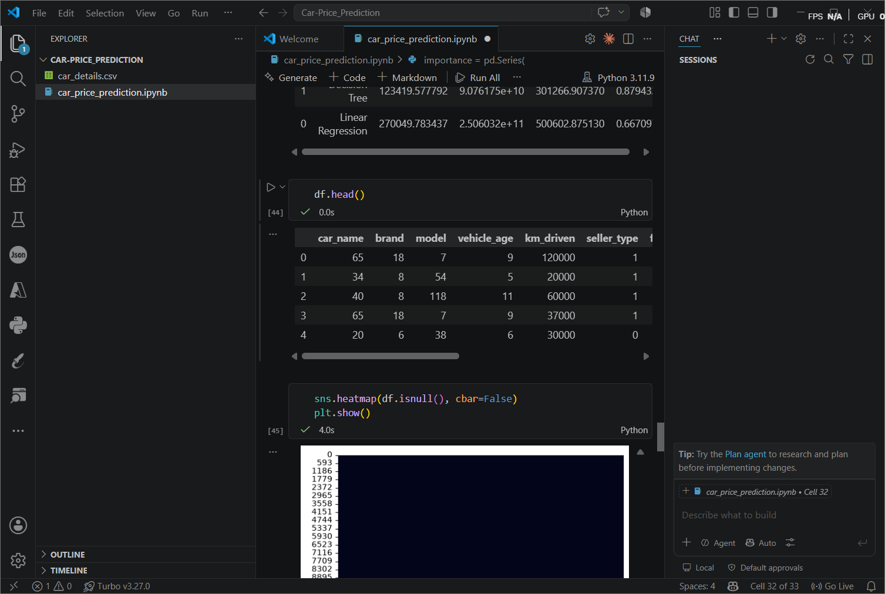
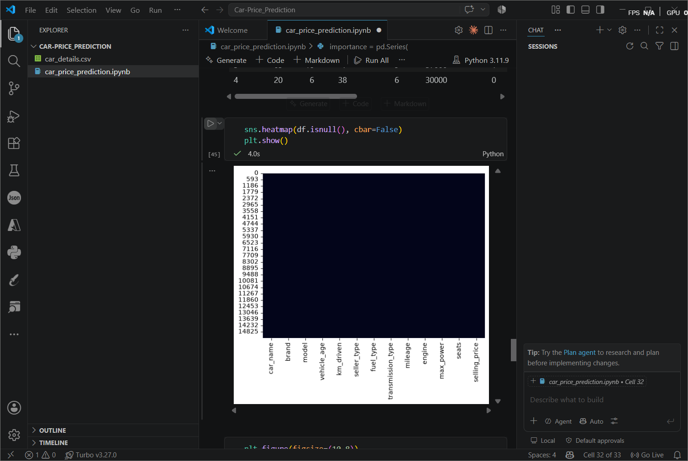
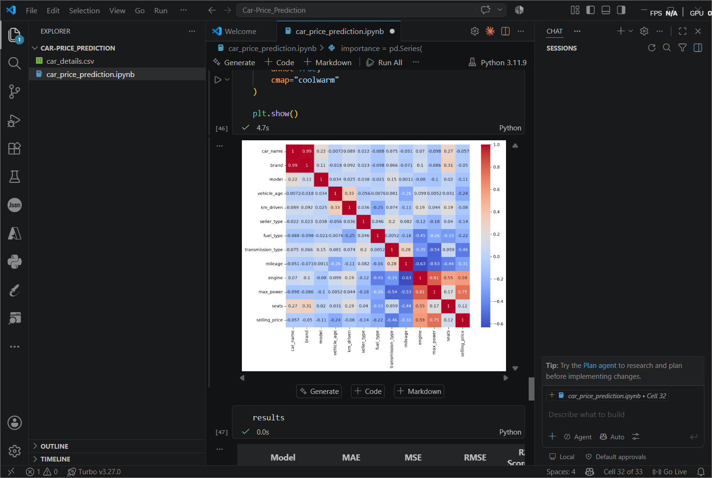
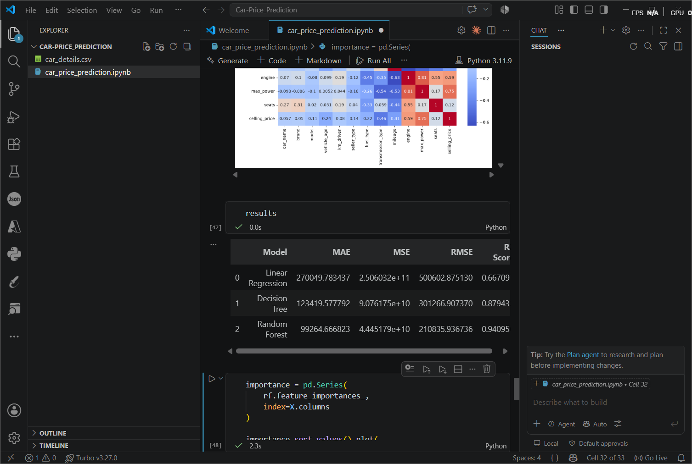
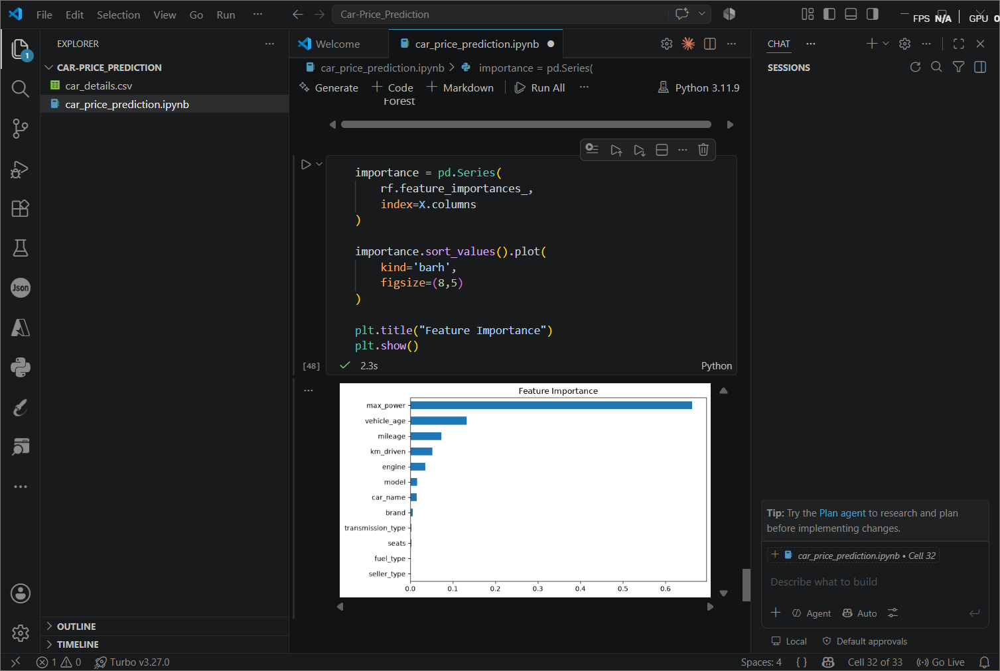

# 🚗 Used Car Price Prediction using Machine Learning

## 📌 Project Overview

This project focuses on building a machine learning regression model to predict the selling price of used cars based on various vehicle characteristics.

The project follows a complete machine learning workflow including:
- Data exploration
- Data preprocessing
- Feature engineering
- Categorical encoding
- Feature scaling
- Regression model development
- Model evaluation and comparison

---

# 🎯 Business Objective

The objective of this project is to develop a model that can accurately estimate the selling price of used cars.

A reliable price prediction system can help:
- Buyers understand the fair market value of vehicles
- Sellers determine competitive pricing
- Automotive platforms automate price estimation

---

# 📂 Dataset Overview

The dataset used in this project is the **CarDekho Used Car Dataset**.

The dataset contains information about used vehicles including:

- Brand
- Model
- Vehicle age
- Kilometers driven
- Fuel type
- Transmission type
- Engine capacity
- Mileage
- Maximum power
- Number of seats
- Selling price

---

# 📊 Dataset Preview



---

# 🔍 Features and Target Variable

## Target Variable

**Selling Price**

The model predicts the selling price of a used car.

---

## Input Features

### Numerical Features

- vehicle_age
- km_driven
- mileage
- engine
- max_power
- seats


### Categorical Features

- car_name
- brand
- model
- seller_type
- fuel_type
- transmission_type

---

# 🛠️ Data Preprocessing

The following preprocessing techniques were applied:

## 1. Missing Value Handling

Missing values were identified and handled using:
- Median imputation for numerical columns
- Mode imputation for categorical columns





---

## 2. Feature Engineering

The dataset already contained processed numerical features.

The following columns were verified:

- Mileage
- Engine
- Maximum Power

These values were already converted into numerical format suitable for machine learning models.

# 🔥 Feature Correlation Analysis

A correlation heatmap was created to understand the relationship between numerical features in the dataset.

Correlation analysis helps identify:
- Features that have strong relationships with each other
- Features that may influence the selling price
- Possible redundant features



**Observation:**

The heatmap shows the correlation between different numerical variables. Features such as engine capacity, maximum power, and vehicle age show meaningful relationships with selling price, helping identify which factors contribute more towards price prediction.


---

## 3. Categorical Encoding

Categorical features were converted into numerical values using:

**Label Encoding**

Encoded columns:

- brand
- model
- fuel_type
- seller_type
- transmission_type
- car_name


---

## 4. Feature Scaling

StandardScaler was applied to normalize numerical feature ranges.

This helps models such as Linear Regression perform better by bringing features to a similar scale.

---

# 🤖 Machine Learning Models Implemented

Three regression models were developed and evaluated:

## 1. Linear Regression

A simple regression algorithm used to understand the linear relationship between car features and selling price.


## 2. Decision Tree Regressor

A tree-based model capable of learning nonlinear patterns from vehicle data.


## 3. Random Forest Regressor

An ensemble learning algorithm that combines multiple decision trees to improve prediction accuracy.

---

# 📈 Model Performance Comparison




| Model | MAE | MSE | RMSE | R² Score |
|-------|------|------|------|----------|
| Linear Regression | 270049.78 | 2.506032e+11 | 500602.88 | 0.6671 |
| Decision Tree Regressor | 123419.58 | 9.076175e+10 | 301266.91 | 0.8794 |
| Random Forest Regressor | 99264.67 | 4.445179e+10 | 210835.94 | 0.9410 |


---

# 🏆 Best Performing Model

Based on the evaluation metrics, the best-performing model was:

## Random Forest Regressor 

### Reason:

Random Forest achieved better performance because:

- It captures complex nonlinear relationships between features
- It reduces overfitting by combining multiple decision trees
- It handles different types of vehicle features effectively


---

# 📊 Feature Importance




Feature importance analysis helps identify which vehicle characteristics contribute most towards predicting selling price.

Important factors generally include:

- Vehicle age
- Engine capacity
- Maximum power
- Mileage
- Brand information

---

# 🔎 Key Observations

- Vehicle specifications strongly influence resale price.
- Newer vehicles generally have higher selling prices.
- Engine capacity and maximum power have significant impact on pricing.
- Ensemble models perform better compared to simpler regression approaches.
- Random Forest provides more accurate predictions compared to Linear Regression and Decision Tree.

---

# 🚀 Future Improvements

The model performance can be improved by:

1. Performing hyperparameter tuning using:
   - GridSearchCV
   - RandomizedSearchCV

2. Using advanced regression algorithms:
   - XGBoost
   - LightGBM
   - CatBoost

3. Applying better feature engineering:
   - Extracting car brand from car name
   - Creating price-per-age features
   - Creating mileage efficiency features

4. Using cross-validation for more reliable evaluation.

---

# 🧰 Technologies Used

- Python
- Pandas
- NumPy
- Matplotlib
- Seaborn
- Scikit-learn
- Jupyter Notebook

---

# 📁 Project Structure

```
Car-Price_Prediction/

│── car_price_prediction.ipynb

│── README.md

│── images/

    ├── dataset_overview.png
    ├── missing_values.png
    ├── correlation_heatmap.png
    ├── model_comparison.png
    └── feature_importance.png

```

---

# ✅ Conclusion

This project successfully demonstrates a complete machine learning regression pipeline for predicting used car prices.

Among the tested models, Random Forest Regressor provided the best prediction performance by effectively learning complex relationships within the dataset.
